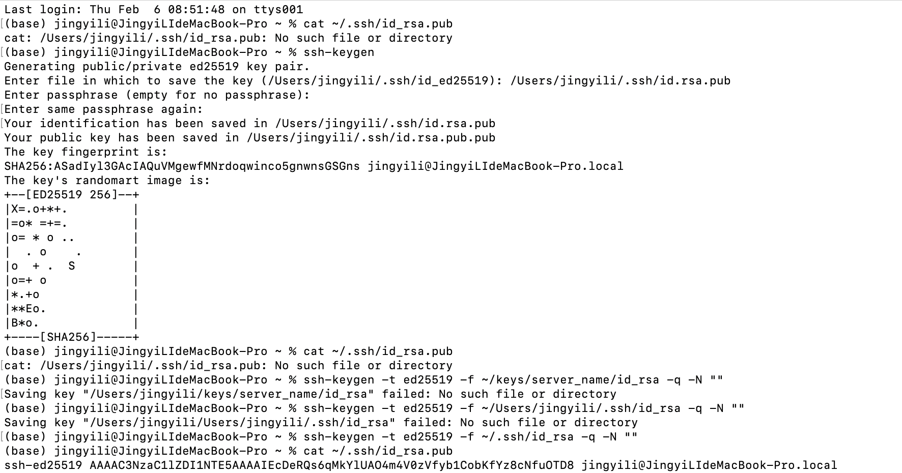
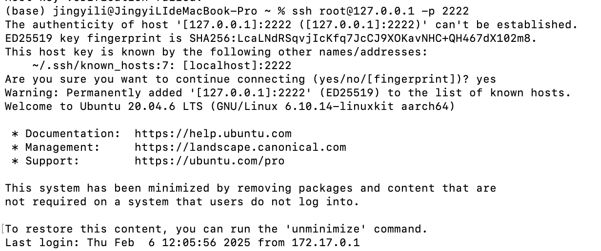
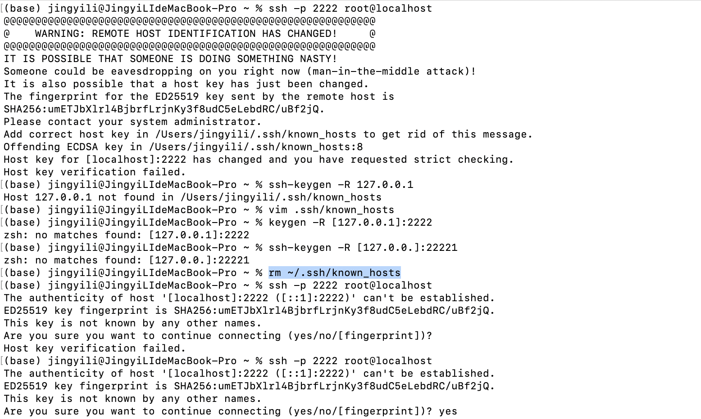

# Docker: Mac 上的 Ubuntu 环境搭建
## 1. 搭建目标
### 在 MacOS 上的 Docker 环境中安装 Ubuntu 镜像并作为虚拟机使用
- 宿主机器操作系统：MacOS:15.3
- 容器环境：Docker for Mac
- 镜像版本：Ubuntu22.04(正文中出现20.04是因为我刚开始选错版本,读者根据自己情况选择即可)
## 2. 详细步骤
### 2.1 安装 Docker for Mac
#### 方法一
直接通过Docker官网下载安装: https://www.docker.com
#### 方法二
使用 Homebrew 直接下载

`$ brew cask install docker`

#### 方法三
阅读别人的教学得知可通过阿里云安装, 我对这种方法不太了解.可以自行搜索.

### 检查是否成功安装

启动 Docker , 打开终端输入代码:

`$ docker --version`

如果成功安装应输出:

Docker version xxx

尝试查看已拉取镜像:

`$ docker images`

显示没有镜像,下一步将拉取ubuntu镜像

REPOSITORY          TAG                 IMAGE ID            CREATED             SIZE

### 2.2 拉取Ubuntu镜像

我使用ubuntu20.04,所以输入:

`$ docker pull ubuntu:20.04`

注意:大家可以根据自己的需求选择版本.如果不指定版本,将下载最新版(latest).

拉取完成后再次检查镜像:

`$ docker images`

成功则得到如下输出

(base) jingyili@JingyiLIdeMacBook-Pro ~ % docker images 

REPOSITORY   TAG       IMAGE ID       CREATED        SIZE

ubuntu       20.04     8e5c4f0285ec   3 months ago   101MB

### 2.3 创建 ubuntu 容器

#### 2.3.1 运行一个可以使用终端交互的ubuntu容器

使用命令: docker run -i -t --name 指定名称 ubuntu(选择版本) bash
我使用:

 `docker run -i -t --name neo ubuntu:20.04 bash`

执行后，就会登陆 ubuntu 容器的 bash 中

(base) jingyili@JingyiLIdeMacBook-Pro ~ % docker run -i -t --name neo ubuntu:20.04 bash

root@f206ec4c5f5a:/# cat /etc/issue

此时也可以查看安装的ubuntu版本,使用命令:

`cat /etc/issue`

得到如下输出:

`Ubuntu 20.04.6 LTS \n \l  `

此时可以检查容器是否成功创建,退出bash:`exit`

输入命令`docker ps -a`,可以看到容器信息

(base) jingyili@JingyiLIdeMacBook-Pro ~ % docker ps -a

CONTAINER ID   IMAGE          COMMAND               CREATED          STATUS          PORTS                                          NAMES

e3993df7534f   702080c8fd5a   "/usr/sbin/sshd -D"   53 minutes ago   Up 53 minutes   0.0.0.0:3333->3333/tcp, 0.0.0.0:2222->22/tcp   neo

#### 2.3.2 以交互的形式启动容器

我们已经成功通过镜像创建了一个对应容器,需要使用时来启动:

`docker start neo`

此时可能发现无法像刚创建时登陆容器的 bash, 加入 -i 参数启动就可以了 `docker start -i neo`

### 2.4 容器配置

#### 2.4.1 基本工具配置

登陆进 ubuntu 的 bash 以后就可以当正常的 ubuntu 进行使用了。一般先更新软件源信息:

`apt-get update`

更新结束后安装vim(用来编辑文件):

`apt-get install vim`

注意: 如果安装过慢可能是镜像问题,可以自行搜索国内源解决方法.

安装 git 和 python3：

`apt-get install git python3   `

#### 2.4.2 SSH配置

1. 通过ssh 连接 ubuntu 容器

安装 openssh-server 用于开启 ssh 服务供外部连接:

`apt-get install openssh-server openssh-client`

安装时需要选择地区

配置 ssh

安装完毕后我们需要修改 sshd_config 的配置：PermitRootLogin 来允许使用 root 权限登入

首先启动 ssh 服务，并查看是否启动成功

2. 更改一下 sshd 的默认配置，编辑文件 /etc/ssh/sshd_config:
   
   `vim ~/etc/ssh/sshd_config`
 
 vi /etc/ssh/sshd_config 空白

 切换为管理员运行
vi /etc/ssh/sshd_config

 注意: 此处涉及vim命令来编辑,可自行搜索. 这里列出一些常见命令:
    按下i键: 切换为insert模式,可以在终端中对文件进行编辑.
    按下esc键:退出insert模式,回到命令行模式(). 
    按下:键,在文件末尾显示的冒号后继续输入w(保存)并回车实现保存,p(退出)并回车.
    依次按下:wp为保存并推出.   

    &PermitRootLogin yes # 可以登录 root 用户
    &PubkeyAuthentication yes # 可以使用 ssh 公钥许可
    &AuthorizedKeysFile  .ssh/authorized_keys # 公钥信息保存到文件 .ssh/authorized_keys 中

使用命令 /etc/init.d/ssh restart 进行重启，配置生效。

1. 添加主机(MacOS)的 ssh 公钥
   
保证此时还是在 ubuntu 容器中。

- 在home目录下创建 .ssh 目录：`mkdir ~/.ssh`
- 新建文件 ~/.ssh/authorized_keys ：`touch ~/.ssh/authorized_keys`
- 新开一个 macOS 下的终端窗口，执行命令 `cat ~/.ssh/id_rsa.pub`，复制打印的一行公钥信息
  注意: 此时可能报错如下:

  (base) jingyili@JingyiLIdeMacBook-Pro ~ % cat ~/.ssh/id_rsa.pub

    cat: /Users/jingyili/.ssh/id_rsa.pub: No such file or directory
而且我搜索该报错,发现可以使用`% ssh-keygen`命令创建密钥,但是仍然报错:

    解决方法: `% ssh-keygen -t ed25519 -f ~/.ssh/id_rsa -q -N "" `
    即可成功得到输出

    (base) jingyili@JingyiLIdeMacBook-Pro ~ % ssh-keygen -t ed25519 -f ~/.ssh/id_rsa -q -N "" 
(base) jingyili@JingyiLIdeMacBook-Pro ~ % cat ~/.ssh/id_rsa.pub
ssh-ed25519AAAAC3NzaC1lZDI1NTE5AAAAIEcDeRQs6qMkYlUAO4m4V0zVfyb1CobKfYz8cNfuOTD8 jingyili@JingyiLIdeMacBook-Pro.local

- 回到 ubuntu 容器中，将第 3 步复制的公钥粘贴到 ~/.ssh/authorized_keys 中保存: `vim ~/.ssh/authorized_keys`, 退出容器.

### 2.5 提交修改到镜像

现在已经推出到正常的 mac 终端窗口中了，容器的修改不会影响到源镜像，上面的操作我们已经完成了 Ubuntu 的基本配置，并且添加了 SSH 支持，这一步是产生新的镜像版本。

#### 2.5.1 制作新镜像

查看刚刚操作的容器信息，执行命令 `docker ps -a `,可以看到 neo 的状态已经是退出了.我们现在使用该容器来创建一个新的镜像:

- 提交
`docker commit <容器id> <镜像名称>`

- 删除掉原来的容器

   & docker stop <容器id>

   & docker rm <容器id>

- 使用刚提交的镜像运行一个新容器

`docker run --name <容器名称> -i -t -p 2222:22 -p 3333:3333 <镜像ID> /usr/sbin/sshd -D`

容器的22端口映射到虚拟机的2222端口

#### 2.5.2 ssh连接

在 macOS 的终端中执行命令 `ssh -p 2222 root@localhost` 即可连接已经启动的 ubuntu 容器 neo

或者通过命令`ifconfig -a`获取ip地址,并使用命令:

`ssh root@xxx.xxx.x.xxx -p 2222` 键入yes回车

均可以访问虚拟机

ps:解决报错

`rm ~/.ssh/known_hosts`

## 3. 连接VScode

在vscode安装插件即可
