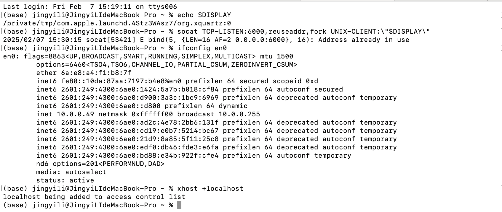

# Docker: 安装ros2 humble镜像及其图形化配置
## 1. 搭建目标
在 Docker 中运行 ROS 2

## 2. 详细步骤
### 2.1 拉取适用于m芯片的docker镜像

GitHub: https://github.com/jiafeng-1/ros2_humble_for_mac_M1

终端输入命令

`docker pull jiaxiaofeng/ros2_humble_mac_m1:1.0`

拉取完成之后，先不急着建立容器，先解决图形化界面的问题。

### 2.2 配置GUI

Docker 容器是命令行的形式，本身不支持图形界面显示，希望 Docker 容器能和Mac主机上的 GUI 进行连接

#### 2.2.1 安装Socat(Socket CAT) 

实现容器和 Mac 主机 GUI 的通信

`brew install socat`

#### 2.2.2 安装Xquartz

##### 2.2.2.1 安装

直接在官网下载安装: 

使用brew安装:

`brew install xquartz`

安装之后可以重启,避免开始时报错.

##### 2.2.2.2 配置

查看环境变量: `echo $DISPLAY`

得到类似如下输出:

`/private/tmp/com.apple.launchd.4Stz3WAsz7/org.xquartz:0`

注:此处我在xquartz的终端xterm查看才得到上面输出.我使用mac主机终端查看时输出是我机器的IP地址.实践证明这个问题与后面可视化窗口有所关系,至于什么关系我还没研究明白.我们先进行主要步骤.

注意:xquartz的“设置-安全”中勾选允许网络客户端链接.

#### 2.2.3 Socat配置 

有了 DISPLAY 环境变量之后，才会对 Socat 进行配置，输入：

`socat TCP-LISTEN:6000,reuseaddr,fork UNIX-CLIENT:\"$DISPLAY\"`

不要终止运行该命令的终端

#### 2.2.4 容器配置

查看主机 OS 上的 IP 地址：

`ifconfig en0`

然后在容器内设置环境变量指向这个 IP 地址（由于退出容器后不会保存环境变量，因此每次进入容器都要执行这个命令）：

`export DISPLAY=上面得到的ip地址`

或者在一开始启动容器时就进行设置：

`docker run -e DISPLAY=IP [image_id]`

完成

#### 2.2.5 测试界面

在容器内安装钟表小动画:

`apt-get install xarclock`

并执行：`xarclock`

可以看到一个钟表窗口

### 2.3 配置ros2

#### 2.3.1 创建ros容器

(base) jingyili@JingyiLIdeMacBook-Pro ~ % docker run -itd --net=host \
-v "Users/jingyili:/home" \
-v "/tmp/.X11-unix:/tmp/.X11-unix" \
-e DISPLAY=10.0.0.49 \
-e GDK_SCALE \
-e GDK_DPI_SCALE \
-e LIBGL_ALWAYS_INDIRECT=1 \
-e ROS_DOMAIN_ID=55 \
--name ros2_humble \
--privileged=true \
-w /home \
jiaxiaofeng/ros2_humble_mac_m1:1.0 \
/bin/bash

- 第2行-v “/Users/jingyili”:左边的地址是自己主机需要被docker容器挂载的地址，右边的地址是对应容器内ubuntu系统的地址。挂载之后，:左边（主机地址内的文件）和右边（docker容器内ubuntu的文件）相对应，即在docker容器里的操作也能影响到主机。
- 第4行-e DISPLAY=xxx \要改成自己主机的IP地址。
- 第9行--name ros2_humble \是设置容器名字，可以根据自己的需求自定义。
- 第11行-w /home选项用于指定Docker容器的工作目录，即容器启动时默认所在的目录。

run命令运行即可。

接下来要进入该容器内:

`docker exec -it ros2_humble /bin/bash`

查看ros安装状态, 常用命令`cd`,`ls`. 发现ros已经安装在/opt/ros/humble里,但还没有配置ros的环境变量。下面来配置环境变量,先安装vim:

 `sudo apt-get update` (或 `apt-get update`)

`sudo apt-get -y install vim` (或`apt-get -y install vim`)

安装完成之后，将ros的环境变量放到.bashrc文件的最后一行中，使用vim打开.bashrc: `vim ~/.bashrc`

在出现的编辑文本的界面里最后一行加入如下命令:

`source /opt/ros/humble/setup.bash`

参考vim基本指令:按i进行编辑，插入完成后按esc推出编辑，再按:wq保存退出.

最后输入命令时修改好的配置生效:

`source ~/.bashrc`

#### 2.3.2 ros界面测试

前面提到在这一步出现问题,输入`ros2 run turtlesim turtlesim_node`并没有出现小乌龟,而是报错: 

qt.qpa.xcb: could not connect to display 10.0.0.49
qt.qpa.plugin: Could not load the Qt platform plugin "xcb" in "" even though it was found.
This application failed to start because no Qt platform plugin could be initialized. Reinstalling the application may fix this problem.

Available platform plugins are: eglfs, linuxfb, minimal, minimalegl, offscreen, vnc, xcb.

[ros2run]: Aborted

然后我又安装xarclock测试,也没有出现钟表:

Error: Can't open display: 10.0.0.49

解决:

我们先update: `apt update`

安装xcb: `apt install -y libxcb-xinerama0 libxcb1`

`apt install -y x11-apps libxcb-xinerama0 libxcb1`

根据自己的系统安装好必要依赖后输入命令:

`export DISPLAY=host.docker.internal:0`

此时再尝试钟表和小乌龟都可以运行了:

`xarclock`

`ros2 run turtlesim turtlesim_node`

总结基本流程: 

- 首先在xterm中查看环境变量`echo $DISPLAY`, 输出:`/private/tmp/com.apple.launchd.4Stz3WAsz7/org.xquartz:0`
- 在主机终端启动socat: `socat TCP-LISTEN:6000,reuseaddr,fork UNIX-CLIENT:\"$DISPLAY\"`
- 接入`export DISPLAY=host.docker.internal:0`
- 即可通过测试`xarclock`或`ros2 run turtlesim turtlesim_node`
